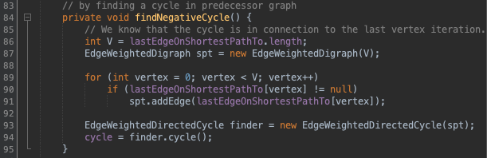
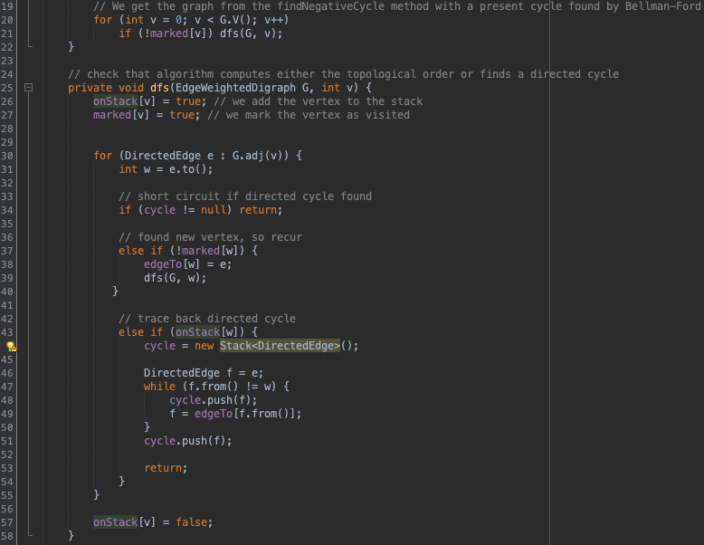

## Introduction
The purpose of the Con Amore assignment is to find a problem we would like to solve, with our knowledge about data structures and algorithms, that we have acquired in the Algorithm and Datastructes course this semester.

## Project info
We were interested in trying to apply our knowledge about the topic shortest paths, to see if we could use it to find a solution to a "real life" problem, with the help of data in a graph-like structure.

There are many shortest path algorithms, and we wanted to learn about one we didnt know about already. Our investigation lead us to find the [Bellman Ford algorithm](https://en.wikipedia.org/wiki/Bellman%E2%80%93Ford_algorithm), an algorithm similar to Dijkstras algortihm, but is able to handle graphs in which some of the edge weights are negative numbers, and ability to detect negative cycles(described "Bellman Ford" section).

We chose to look at applications of this alghorithm, in real life scenarios, as why would a negative cycle be usefull or unwanted in a graph. (ADD REFRENCE TO OTHER STUFF) 

Looking around we have found an interesting application, of the alghoritm in a atypic way. The usage was to be able to detect an We found out that this is quite useful to use in a scenario were you want to detect an [Arbitrage](https://en.wikipedia.org/wiki/Arbitrage) in a weighted digraph, which in short terms means, that you could find profitable trades in cross trading valuables such as Currency.

## Bellman-Ford

Bellman-Ford is a graph algorithm that similary to Djikstra can be used to find shortest path from a source vertex to another. An other attribute of the alghoritm is it's capability to be able to detect whether a negative weight cycle exists within the graph.
Like Dijkstra's algorithm, Bellman–Ford proceeds by relaxation, in which approximations to the correct distance are replaced by better ones until they eventually reach the solution. In both algorithms, the approximate distance to each vertex is always an overestimate of the true distance, and is replaced by the minimum of its old value and the length of a newly found path. However, Dijkstra's algorithm uses a priority queue to greedily select the closest vertex that has not yet been processed, and performs this relaxation process on all of its outgoing edges; by contrast, the Bellman–Ford algorithm simply relaxes all the edges, and does this |V|-1 times, where |V| is the number of vertices in the graph. In each of these repetitions, the number of vertices with correctly calculated distances grows, from which it follows that eventually all vertices will have their correct distances. This method allows the Bellman–Ford algorithm to be applied to a wider class of inputs than Dijkstra.

#### Main differences between Dijkstra and Bellman-Ford
1. Bellman time complexity is O(VE) and Dijkstra Algo has O(ElogV)in case of maxheap is used.
2. Bellman does relaxation for n-1 times and Dijkstra Algo only 1 time.
3. Bellman can handle negative weights but Dijkstra Algo can't.
4. Bellman visit a vertex more then once but Dijkstra Algo only once.

#### Pseudo code


*Line 7* **Run for each vertex in graph thus |V-1| iterations**

*Line 8* **Run for each Edge from vertex thus |V-1| * |E|**  *(removing constant time complexity = **O(|V|\*|E|)** )*

*Line 10* **Relaxation function**

*Line 14* **Check for negative cycle existance**


#### Time complexeties for Bellman Ford
**The time complexity** for Bellman Ford is O(|V|*|E|), where V is the amount of vertices and E is the amount of Edges. For each possible destination vertex from the source, we will check all Edges to find the "cheapest" way to this vertex from the source.

**The space complexity** for Bellman Ford is O(|V|). (maybe update?)

The alghorithm is significantly slower than Dijkstra, but this is outweight by its capability to be able to process negative weights, which is where it is preffered over Dijkstra.

#### Why can Dijkstra's alghorithm not handle negative numbers ?
Dijkstra's algorithm is unable to handle negative cycles as it only vists every vertice once (only one iteration in Dijkstra). It is actually able to handle negative weights, however, it will not choose the shortest path in this case since it is a greedy algorithm.


With Dijkstra, if we have to find the shortest path from A --> C, Dijkstra will be greedy and just choose the direct path from A -- C. Dijkstra is not meant to deal with negative weights, and does therfore not expect the path to be reduced because of negative weights.

#### Arbitrage detection
We then found out, that to be able to detect arbitrage within data in a graph structure, one needs to be able to locate a *negative cycle* in the graph.

If a graph contains a "negative cycle" (i.e. a cycle whose edges sum to a negative value) that is reachable from the source, then there is no cheapest path: any path that has a point on the negative cycle can be made cheaper by one more walk around the negative cycle. 
This might sound contradicting towards profitting off of it, but this is where we replace each weight by its negated natural logarithm **(*ln()*)** of the weight. So when the total sum of the weights are negative, we actually make money off of it.

Example: 


This shows an arbitrage opportunity in a graph, and this is exactly what Bellman Ford is able to detect, by finding a negative cycle. Here, the conversion rate between each currency has been converted to the negated natural logarithm **(*ln()*)** of the rates(weights). 

```
int V = amountOfVertices;

        EdgeWeightedDigraph G = new EdgeWeightedDigraph(V);
        for (int sourceVertice = 0; vertice < V; v++) {

            for (int targetVertice = 0; targetVertice < V; targetVertice++) {
                double rate = weightOfEdge;
                DirectedEdge e = new DirectedEdge(sourceVertice, targetVertice, -Math.log(rate));
                G.addEdge(e);
            }
        }
```
*Above illustrates how this is done in some pseudo code*

This will result in a negative cycle that actually is profitable, as the numbers in original form are positive, but by harnessing the power of Bellman-Ford's ability to find negative cycles, we will be able to find them when the numbers are negated.


## Application of the alghorithm 

We wanted to see if we could find some real data, to see if the algorithmic logic was applicable to real life data. 

We found some **Cryptocurrency trading exchange data**, on [Binance](https://en.wikipedia.org/wiki/Binance), one of the largest cryptocurrency exchanges in the world. On here, we selected a quick snapshot of conversion rates for the cryptocurrencies BTC (Bitcoin), LTC (Litecoin), ETH (Etherium) and BCH (Bitcoin Cash):

**Dataset** (30-05-2020 snapshot)

|  | BTC | LTC | ETH | BCH |
| --- | --- | --- | --- | --- | 
| **BTC** | 1 | 203.79 | 40 | 39 | 
| **LTC** |   0.0049 |  1 | 0.2 | 0.195| 
| **ETH** |   0.025 |   5 |       1  |    0.975| 
| **BCH** |   0.02562 |  5.125 |   1.025 |  1| 

---

The above was our data, below in the upper part of the image, we see the negated natural logarithm applied to all the fields, and then we run the alghorithm to retrieve the results displayed in the bottom. This result tells us that in case we started up with 1000.00 BTC, and traded them to LTC then TO BCH and back to BTC, we would have profited around 1,8% each time. (YAY WE ARE RICH :D) This is true except that the exchanges do take some money to do the transfers and these are not present in our alghorithm. (so maybe not so profitable... :( ) 


#### How do we get this result ?
So if we encounter a negative cycle, we ensure that we record it and terminate the alghorithm as a presence of this could make the alghorithm continue util |V-1|, this is not necessary in our case as we found what we are looking for. We save the occurance of a cycle, (*Lines 88-92 in image below*) creating a new weighted digraph, and iterate the current visited vertices in reverse order, as we know the cycle has just occured and probably is in the end, though in worse case it could be the source node.
 



Then we Provide it to a class that does a Depth First Search, and upon an edge that points to a previously visited vertex, we terminate search and record the path in a Stack, which represents the cycle.
A DFS search is in best case O(|V|+|E|) and in worst case O(|V|), in our case we are certain that a cycle exists thus we would always expect best case scenario.

